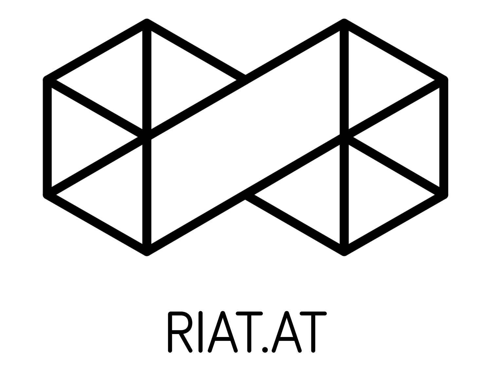
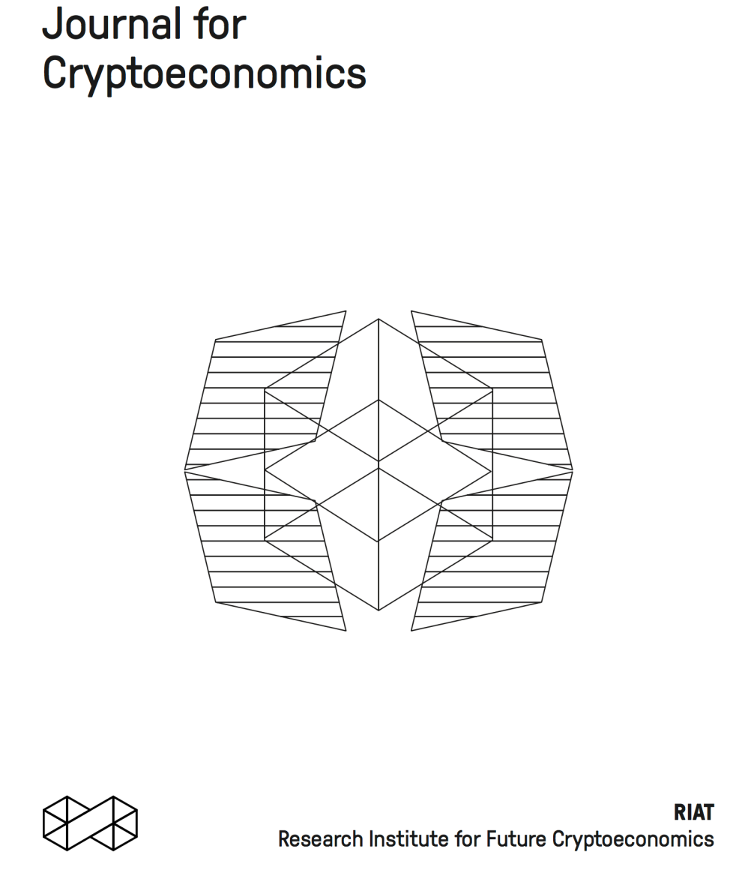
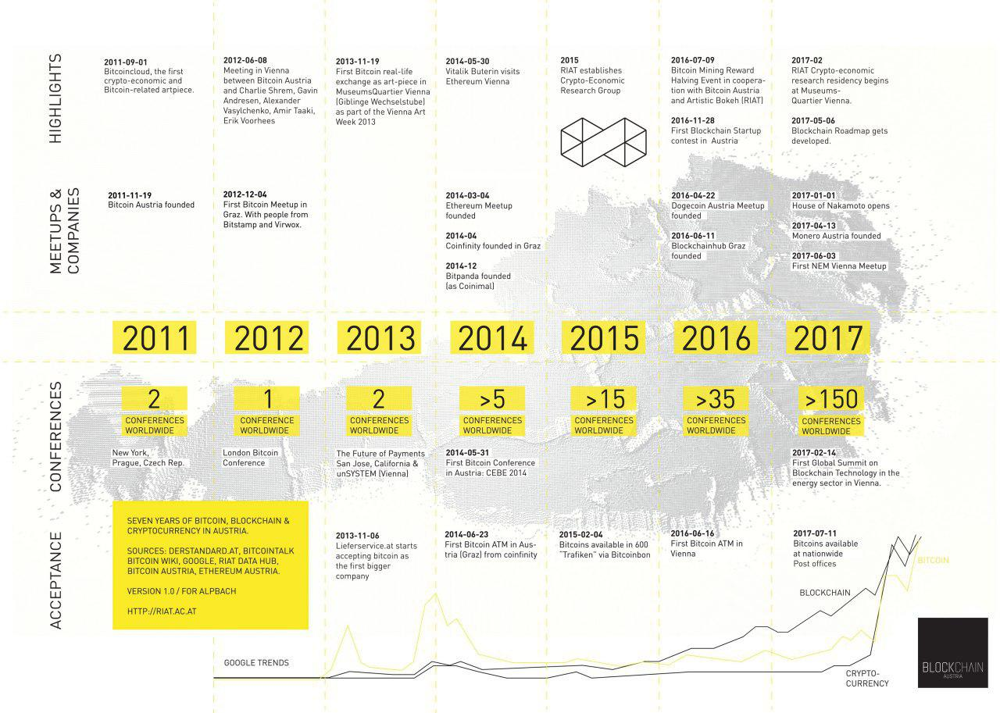

title: Introduction to Cryptoeconomics
subtitle: RIAT Crowdsale Research Group
description: Laboratory for Future Cryptoeconomics
author: Daniel Pichler
theme: black

## RIAT

Matthias Tarasiewicz, mt@riat.at
Director, RIAT
Institute for Future Cryptoeconomics

RIAT is an institute for reseach, development,  
communication and education in the field
cryptoeconomics and the blockchain.

Education
Communication
Consulting

##Riat.SPACE

Riat.space with 300$m^2$ in the center of Vienna, Austria is a place where
meetups, events and workshops as well as the RIAT Academy are held. It is also one
of the physical locations of the Laboratory for Future Cryptoeconomics

Last events:
2018-03-06 	[Ethereum Meetup] (Tech) Swarm Week Results, Data Fund
2018-02-27 	[Book Launch] Making.Artistic.Technology Presentation
2018-02-22 	[Ethereum Meetup] (Tech) Deep Dive into Maker (MakerDAO)
2018-02-08 	[Ethereum Meetup] (User) Education on the Blockchain with ODEM + Etherchain
2018-02-03 	[Presentation] Cryptoeconomics as Data Loam (Transmediale, Berlin)
2018-02-02 	[Forkshop] Fork-Politics in Post-Consensus Cryptoeconomics (Transmediale, Berlin)

[>Laboratory for Future Cryptoeconomics  ](https://riat.at/cryptoeconomics/laboratory-for-future-cryptoeconomics/)
[>Residency for Future Cyrptoeconomics  ](https://riat.at/cryptoeconomics/research-residency-for-future-cryptoeconomics/)
[>Journal for Cryptoeconomics  ](https://riat.at/cryptoeconomics/journal-for-cryptoeconomics/)

Presentation Structure:

(1) Historic Information
(2) Development in Austria
(3) Cryptoeconomics

## History

The design of secure 'digital cash' systems was first postulated by David
Chaum (1982) and the discourse continued (Chaum 1990; Tanaka, 1996;
Szabo, 1997; Dai, 1998; Van Hove 2000) until 2008, when Satoshi
Nakamoto introduced Bitcoin with a self-published paper (Nakamoto
2008) describing the blockchain ledger and inventing the first ‘cryptocurrency’. (Tarasiewicz, 2015)
Cryptocurrencies as Distributed Community Experiments
in: Handbook of Digital Currency, Academy Press // http://parasew.com

## The Times 03/Jan/2009
  Chancellor on brink of second
  bailout for banks

| 00000000 |   |   | 01 | 00 | 00 | 00 | 00 | 00 | 00 | 00 |   | 00 | 00 | 00 | 00 | 00 | 00 | 00 | 00 |   |   | ................ |
|----------|---|---|----|----|----|----|----|----|----|----|---|----|----|----|----|----|----|----|----|---|---|------------------|
| 00000010 |   |   | 00 | 00 | 00 | 00 | 00 | 00 | 00 | 00 |   | 00 | 00 | 00 | 00 | 00 | 00 | 00 | 00 |   |   | ................ |
| 00000020 |   |   | 00 | 00 | 00 | 00 | 3B | A3 | ED | FD |   | 7A | 7B | 12 | B2 | 7A | C7 | 2C | 3E |   |   | ....;£íýz{.²zÇ,> |
| 00000030 |   |   | 67 | 76 | 8F | 61 | 7F | C8 | 1B | C3 |   | 88 | 8A | 51 | 32 | 3A | 9F | B8 | AA |   |   | gv.a.È.ÈŠQ2:Ÿ¸ª |
| 00000040 |   |   | 4B | 1E | 5E | 4A | 29 | AB | 5F | 49 |   | FF | FF | 00 | 1D | 1D | AC | 2B | 7C |   |   | K.^J)«_Iÿÿ...¬+| |
| 00000050 |   |   | 01 | 01 | 00 | 00 | 00 | 01 | 00 | 00 |   | 00 | 00 | 00 | 00 | 00 | 00 | 00 | 00 |   |   | ................ |
| 00000060 |   |   | 00 | 00 | 00 | 00 | 00 | 00 | 00 | 00 |   | 00 | 00 | 00 | 00 | 00 | 00 | 00 | 00 |   |   | ................ |
| 00000070 |   |   | 00 | 00 | 00 | 00 | 00 | 00 | FF | FF |   | FF | FF | 4D | 04 | FF | FF | 00 | 1D |   |   | ......ÿÿÿÿM.ÿÿ.. |
| 00000080 |   |   | 01 | 04 | 45 | 54 | 68 | 65 | 20 | 54 |   | 69 | 6D | 65 | 73 | 20 | 30 | 33 | 2F |   |   | ..EThe Times 03/ |
| 00000090 |   |   | 4A | 61 | 6E | 2F | 32 | 30 | 30 | 39 |   | 20 | 43 | 68 | 61 | 6E | 63 | 65 | 6C |   |   | Jan/2009 Chancel |
| 000000A0 |   |   | 6C | 6F | 72 | 20 | 6F | 6E | 20 | 62 |   | 72 | 69 | 6E | 6B | 20 | 6F | 66 | 20 |   |   | lor on brink of  |
| 000000B0 |   |   | 73 | 65 | 63 | 6F | 6E | 64 | 20 | 62 |   | 61 | 69 | 6C | 6F | 75 | 74 | 20 | 66 |   |   | second bailout f |
| 000000C0 |   |   | 6F | 72 | 20 | 62 | 61 | 6E | 6B | 73 |   | FF | FF | FF | FF | 01 | 00 | F2 | 05 |   |   | or banksÿÿÿÿ..ò. |
| 000000D0 |   |   | 2A | 01 | 00 | 00 | 00 | 43 | 41 | 04 |   | 67 | 8A | FD | B0 | FE | 55 | 48 | 27 |   |   | *....CA.gŠý°þUH' |
| 000000E0 |   |   | 19 | 67 | F1 | A6 | 71 | 30 | B7 | 10 |   | 5C | D6 | A8 | 28 | E0 | 39 | 09 | A6 |   |   | .gñ¦q0·.\Ö¨(à9.¦ |
| 000000F0 |   |   | 79 | 62 | E0 | EA | 1F | 61 | DE | B6 |   | 49 | F6 | BC | 3F | 4C | EF | 38 | C4 |   |   | ybàê.aÞ¶Iö¼?Lï8Ä |
| 00000100 |   |   | F3 | 55 | 04 | E5 | 1E | C1 | 12 | DE |   | 5C | 38 | 4D | F7 | BA | 0B | 8D | 57 |   |   | óU.å.Á.Þ\8M÷º..W |
| 00000110 |   |   | 8A | 4C | 70 | 2B | 6B | F1 | 1D | 5F |   | AC | 00 | 00 | 00 | 00 |    |    |    |   |   | ŠLp+kñ._¬....    |

## A Brief Bitcoin History

2008 - Domain name "bitcoin.org" registered (Aug 15th)
    Bitcoin design paper published (Nov 31st)
2009 - Bitcoin v0.1 released (Jan 11th)
    First Bitcoin transaction (Jan 12th)
    Exchange rates: $1 = 1,309.03 BTC (Oct 5th)
2010 - Pizza bought with Bitcoins for 10,000 BTC (May 21st)
    Bitcoin mentioned on slashdot (Jul 11th)
    MTGOX established (Jul 17th)
    Bitcoin economy passes US $1 million.
    MtGox price touches USD $0.50/BTC (Oct 7th)

2011 - Largest numeric value ever traded for bitcoins thus far: 12 BTC for $300,000,000,000,000 Zimdollars (Jan 27th)
    Bitcoin reaches parity with the US dollar, touching $1 per BTC at MtGox. (Feb 9th)
    Exchange Networks compromised, accounts hacked: (60,000 on MTGOX, 600 on MyBitCoin) (June 19th)
    MTGOX handles over 80% of all Bitcoin trade (July 1st)
2012 - Largest theft of bitcoins to-date occurred (near 50K BTC) after security breach at web host Linode (May 1st)
    Formation of the "Bitcoin Foundation" (Sept 27th)
    Wordpress.org supports Bitcoin payments because PayPal blocks access from over 60 countries (Nov 15th)
    First Bitcoin exchange licensed "as a bank" in europe (Bitcoin-Central.net) (Dec 6th)
2013 - Current Bitcoin stats on mtgox: Last price:$59.85026 High:$60.88800 Low:$53.00000 (Mar 20th)

##cryptoeconomics.

##cryptography + economics

##cryptoeconomics =
##cryptography, computer
##networks and game theory

###Cryptoeconomics focuses on the design
###and characterisation of protocols that
###govern the production, distribution, and
###consumption of goods and services in a
###decentralised digital economy.

##the study of economic
##interaction in an
##adversarial environment.

##Cryptoeconomic design
##focusses on creating
##systems with rules,
##incentives and penalties.

##creating mechanisms
##(rules) to produce an
##equilibrium outcome.

##Cryptoeconomic systems
##are decentralised and
##based on cryptography.

###“(I’ve been working on bitcoin’s design)
###since 2007. At some point I became
###convinced there was a way to do this
###without any trust required at all and
###couldn’t resist to keep thinking about it.”
###-- Satoshi Nakamoto

##Cryptoeconomics provides
##a security guarantee for a
##distributed system.

##Cryptoeconomics are often
##based on real-world economics
##(e.g. 51% attacks are very costly)

#Background

####In the 1970s, three different developments (the ciphers
####DES and RSA, and the Diffie-Hellman key exchange)
####came about, allowing individuals with modest
####computing resources to encrypt communication.

###Bitcoin and the
###Blockchain are a product
###of cryptoeconomics.

###Satoshi Nakamoto (2008)
###presented the first
###cryptoeconomic system.

###Solution to the “Byzantine
###Generals’ Problem” through
###economic incentives and
###basic cryptographic tools.

###finding consensus over
###the state of a system in
###an zero-trust
###environment.

###finding consensus over
###the state of a p2p system
###in an zero-trust
###environment.

###solving the problem of
###‘double spending’

###Nakamoto solved this by
###using a combination of
###economic incentives and
###basic cryptographic tools.

###(1) public - private key
###cryptography
###(2) proof-of-work with
###incentive

##cryptoeconomics today

###*Consensus protocols
###*Cryptoeconomic application
###designs (e.g. based on smart
###contracts)
###*State channels (judges)

###Example: bittorrent
###(p2p filesharing)
###lack of incentives to further
###seed a file after downloading.

###SIA (siacoin) as an
###example for incentivising
###the distributed storage
###through smart contracts
###and escrow.

###Example: Augur
###REP tokens are incentivising the
###creation of prediction markets,
###as well as ‘telling the truth’.

###Evaluating tokens:
###What is the cryptoeconomic
###mechanism of the token?

#wrap-up

###for the first time in history we are
###living in a time where we can
###design our experimental economic
###systems, and ultimately have them
###adopted and tested in real-time
###with a large number of
###participants.

###Newman & Tarasiewicz (2014)
###“Cryptocurrencies as distributed
###community experiments”
###RIAT (2018) “Cryptoeconomics”

[riat.at](https://www.riat.at)